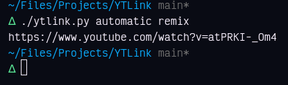
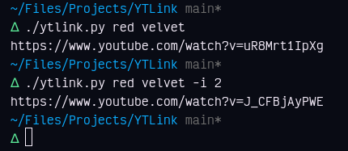

# YTLink
Search YouTube and get a single link as the output.

# Install
> Requires Python 3.2+  
```sh
git clone https://github.com/TorchedSammy/YTLink
cd YTLink
pip install youtube-search
```  

# Usage
`./ytlink <query>`  
If python is ran with a command other than `python3`, you'll have to run it directly instead:  
`python ytlink.py <query>`

# Examples
  


